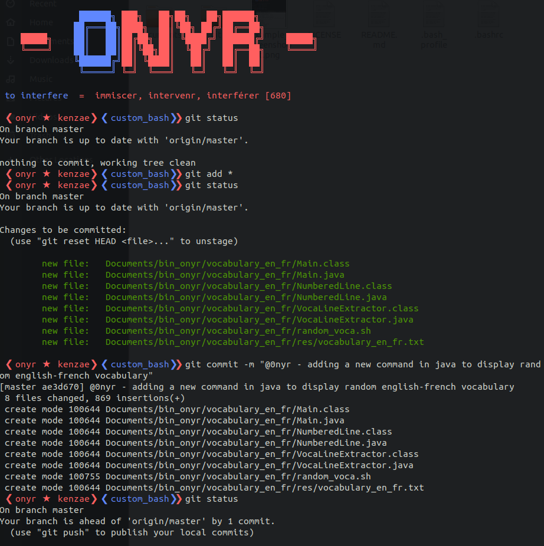

# 🌟 custom_bash


Custom configs around **Bash**.



# 🚀 The concept

This repository is a handy place to hold small terminal apps and bash configs.

Install process:

0. Clone the repository in your home directory.
1. Create a backup of you `.bashrc`.

```shell
mv ~/.bashrc ~/custom_bash/backup/.bashrc.bk
```

2. Make a symlink to the new `.bashrc` of this repository

```shell
mv ~/.bashrc ~/custom_bash/backup/.bashrc.bk
```

NB: In this repository `.bashrc`, don't forget to update `CUSTOM_BASH_PATH` with your personal path where this repo is located.

# 🚨 New 1.3 Version

## Learn your english vocabulary in your terminal ;) (seriously)

I added a new command: `voca [number, default = 1][-e]` that I programmed in Java. This command takes a number as parameter, the default value being 1. This command select a random line in the vocabulary_en_fr.txt file and displays it. I modified the .bash_profile and bash_aliases_onyr.sh to make the command run at launch.

```shell
voca [OPTION]

AVAILABLE OPTIONS
	<int> - Display <int> random vocabulary words from vocabulary_en_fr.txt
	-e - Launch gedit to modify the vocabulary_en_fr.txt file in case you 
	     what to add new words or correct mistakes
```

NB: You can dissable it by just removing the line `voca` in bash_aliases_onyr.sh.

# ⚒ Get more info and tools to edit your own config file

Bash/Prompt customization: https://wiki.archlinux.org/index.php/Bash/Prompt_customization

256 COLORS - CHEAT SHEET: https://jonasjacek.github.io/colors/

Bash tips: Colors and formatting: https://misc.flogisoft.com/bash/tip_colors_and_formatting

Terminal codes (ANSI/VT100) introduction: https://wiki.bash-hackers.org/scripting/terminalcodes

Unicode UTF-8 symbol picked: https://unicode-table.com/en/sets/star-symbols/

ASCII text converter: http://www.patorjk.com/software/taag/#p=display&f=Graffiti&t=Type%20Something%20

Ubuntu transparent terminal: https://www.how2shout.com/how-to/change-terminal-color-ubuntu-linux-background-text.html

# 🍪 Modify the command prompt (PS1)

Some commands, tips and code snippets to edit you prompt

## important notes

▶: Wrapping the tput output in `\[` `\]` is recommended by the Bash man page. This helps Bash ignore non-printable characters so that it correctly calculates the size of the prompt.

▶: `\[` escape is used to begin a sequence of non-printing characters

▶: `\]` escape is used to signal the end of such a sequence

▶: `\e` or `\033` or `\x1b` is shorthand for the Escape character

▶: writing in this script `BLUE= "any_value"` will result in bash to think it is a command because of the space after the = sign, and return an error!

## 256 Color font attributes

▶: This is what you can use to define colors for your prompt, replace # with an int (0 - 255) to pick a color. Use tools to help you.

```shell
\x1b[38;5;#m (foreground), # = 0 - 255 to pick a specific color 

\x1b[48;5;#m (background), # = 0 - 255 to pick a specific color
```

## True Color

▶: Only works with "echo -e" command, not inside the PS1 variable!

```shell
\x1b[38;2;r;g;bm r = red, g = green, b = blue foreground

\x1b[48;2;r;g;bm r = red, g = green, b = blue background
```

## True Color off

▶: Only works with "echo -e" command, not inside the PS1 variable!

```shell
off = '\x1b[0m' # off

default = '\x1b[39m' # default foreground

DEFAULT = '\x1b[49m' # default background
```

## Font attributes

▶: Only works with "echo -e" command, not inside the PS1 variable!

```shell
bd = '\x1b[1m' # bold

ft = '\x1b[2m' # faint

st = '\x1b[3m' # standout

ul = '\x1b[4m' # underlined

bk = '\x1b[5m' # blink

rv = '\x1b[7m' # reverse

hd = '\x1b[8m' # hidden

nost = '\x1b[23m' # no standout

noul = '\x1b[24m' # no underlined

nobk = '\x1b[25m' # no blink

norv = '\x1b[27m' # no reverse
```

## Examples

▶: possibility to use RGB colors only with echo -e command

▶: Inside PS1, rather use the 256 colors available, use Tool> 256 color picker and Tool> 256 color format to help you.

```shell
echo -e "\x1b[38;2;50;50;50m Welcome BACK \x1b[39m ${BLUE}"

echo -e "\x1b[48;2;100;100;100m Hello boiiii \x1b[49m"
```

## Tools

256 color format: https://misc.flogisoft.com/bash/tip_colors_and_formatting

256 color picker: https://jonasjacek.github.io/colors/
